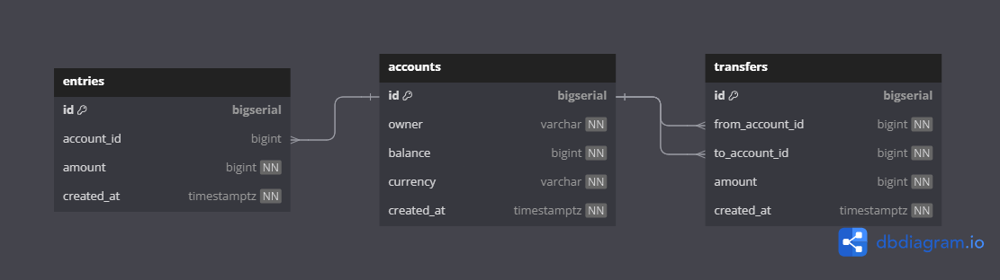

# Bank Application (DEV DOCS)

## Database Design and Setup

Design the database schema diagram using `dbdiagram.io` and convert the diagram to `SQL` script.

The `dbml` file used to generate the sql script is available [here](./db_diagram_io.dbml).